# Semantic Graph Explorer for Sustainable Development

A submission for the [TigerGraph Graph for All Challenge](https://www.tigergraph.com/graph-for-all/) by Mike Willekes
- [YouTube Project Overview](https://youtu.be/1IZuQx_rjx4E)
- [Mail](mailto:mikewillekes@gmail.com)
- [Twitter](https://twitter.com/mikewillekes)
- [GitHub](https://github.com/mikewillekes)
- [LinkedIn](https://www.linkedin.com/in/mikewillekes/)

## **Graph for a Better World:** Enable Search for United Nations Sustainable Development Goals

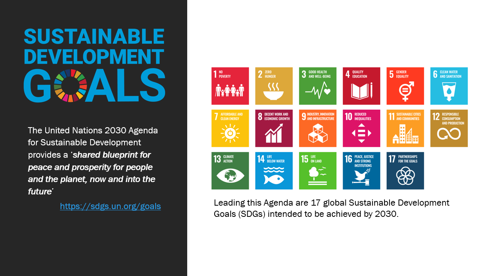

The Sustainable Development Goals are highly interconnected: for example, goals targeting resilience of the poor and sustainable food production are linked to adverse impacts of climate change and improving food production by combating desertification and improving  soil quality.

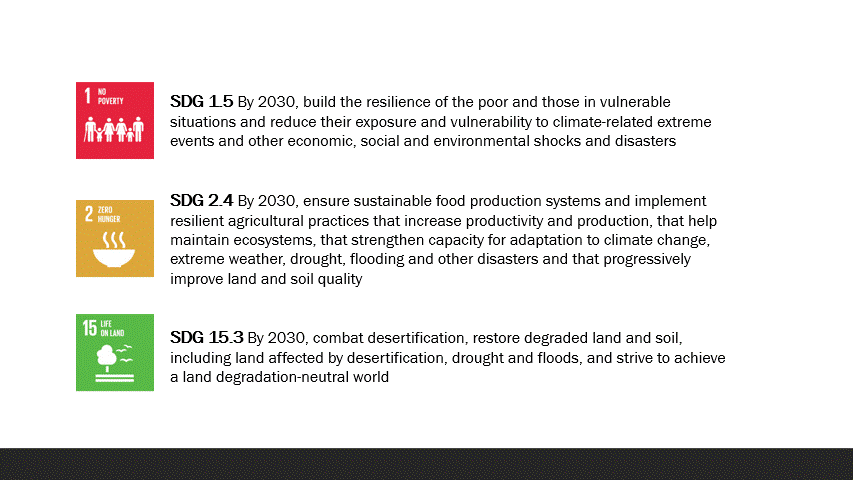

At a small scale it’s easy to visually identify these links and interconnected themes, but at a large scale this can be exceedingly difficult. Researchers and domain experts typically publish their findings in lengthy books, scientific papers and institutional reports.

A researcher, development analyst or project coordinator looking for findings that link SDG 2.4 _"sustainable and resilient agricultural practices"_ and SDG 15.3 _"combating desertification and soil restoration"_ in Central America with topics-or-themes of  _"property rights of indigenous communities"_ has to search through hundreds or thousands of pages of PDFs from organizations like:
- [UNICEF](https://data.unicef.org/resources/)
- [The World Bank Open Data Repository](https://openknowledge.worldbank.org/)
- [The International Union for Conservation of Nature](https://portals.iucn.org/library/dir/publications-list)
- [Intergovernmental Platform for Biodiversity and Ecosystem Services](https://ipbes.net/assessing-knowledge)
- [IPCC The Intergovernmental Panel on Climate Change](https://www.ipcc.ch/report/sixth-assessment-report-cycle/)
- [Millennium Ecosystem Assessment](https://www.millenniumassessment.org/en/index.html)

## Natural Language Processing and TigerGraph to the Rescue!

The concept of applying Natural Language Processing techniques to extract and construct knowledge graphs from unstructured text is not new. I personally began working on projects in this technical domain more than ten years ago. However, what once took years of R&D by a team of researchers and engineers, is now achievable by a proficient solo-developer in a few weeks on commodity hardware. What *has* changed recently is:

- The availability of powerful, pre-trained NLP Language Models
- SaaS graph database platforms, like [TigerGraph](https://www.tigergraph.com/), with great community support and a low barrier to entry


The goal of this project was to build a solution that empowered non-technical (about programming, web-crawling, machine learning or graph databases) users to easily discover links between Documents, SDGs, Entities (people, places and organizations) and Topics, while always retaining the link back to a source document or paragraph.

### A Single Document
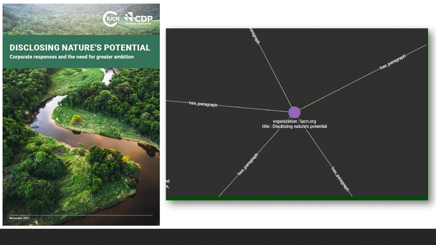

### Multiple Documents
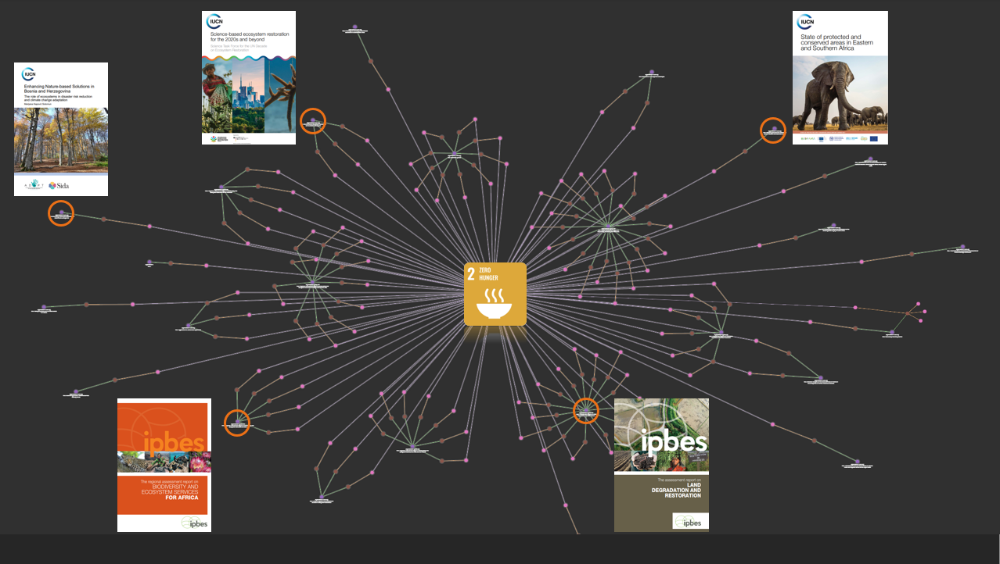

This final aspect significantly increased the technical complexity of the solution. Many described and published approaches focus only on extracting and building a Knowledge Graph, stopping at presenting their results as a [traditional node-linked diagram](https://www.google.com/search?q=nlp+build+knowledge+graph&tbm=isch&chips=q:nlp+build+knowledge+graph,online_chips:named+entity+recognition) (such as the screenshot above), which is great for conveying the results to other graph professionals, but difficult to navigate for non-technical users. A user-friendly Web Application front-end would need to be built backed by TigerGraph as the data engine.

### Explore SDGs
Use the **Semantic Graph Explorer for Sustainable Development** to find links between SDG 15.7 _"Take urgent action to end poaching and trafficking of protected species of flora and fauna and address both demand and supply of illegal wildlife products"_ and the topic "Women, rights and Gender-Based Violence" which are linked in the document [Gender-based violence and environment linkages (IUCN 2020)](https://portals.iucn.org/library/node/48969)


### Explore Entities
Use the **Semantic Graph Explorer for Sustainable Development** to find SDGs, Topic, Documents and Entities related to Bangladesh.


### Explore a Document
Using a [Ploty](plotly.com) and the data in TigerGraph, it's possible to explore the SDG, Entity and Topic relationships with a document in a visual format. This capability was developed very late, and though it makes for an interesting visual - the analytic usefulness is limited in the current form.
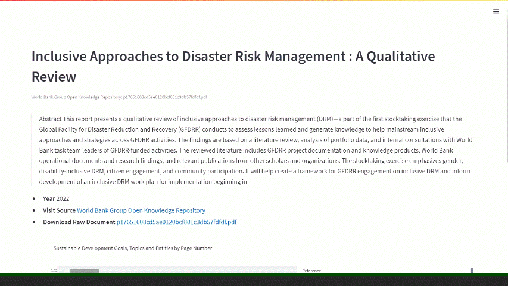

# Technical Details

Everything necessary to reproduce this solution is available in the Github repo: [mikewillekes/unsdgftw](https://github.com/mikewillekes/unsdgftw)

The end-to-end pipeline is as follows:

- Install Python prerequisites via `pipenv`
- Raw Data Acquisition and Preprocessing
    - This is the only manual step as some of the source PDFs were manually download and converted to XHTML using Apache Tika
    - These PDFs can quite large so are *not* included in the Git repo, however the outputs of **Clean Text** *are* included in the repo so the entire graph solution can be recreated 
- Clean Text
    - Extract Paragraphs
    - Extract Sentences
    - Extract Entities
- NLP
    - Semantic Similarity
    - Topic Modelling
- Graph
    - Create TigerGraph Schema from empty Solution
    - Install GSQL Queries
    - Build CSV files for loading
    - Load CSV files to TigerGraph
    - Augment Graph by building co_mention edges between SDGs, Entities and Topics
    - Community detection via label propagation (result stored in `lid` attribute)
    - Closeness Centrality calculation (result stored in `cent` attribute)
- Streamlit Application UI
    - Launch Streamlit app to view UI

## Raw Data Acquisition and Preprocessing

The `corpus` directory contains all the staged and processed data for the NLP and Graph. There are 5 top-level directories corresponding to each of the datasources, each directory has a `metadata.jsonl` file describing all the metadata for each source document:

- `corpus/IPBES/metadata.jsonl`
    - 8 documents (PDF) from the [Intergovernmental Platform for Biodiversity and Ecosystem Services](https://ipbes.net/assessing-knowledge)
- `corpus/IPCC/metadata.jsonl`
    - 1 document (PDF) from the [Intergovernmental Panel on Climate Change](https://www.ipcc.ch/report/sixth-assessment-report-cycle/)
- `corpus/IUCN/metadata.jsonl`
    - 53 documents (PDF) from the [International Union for Conservation of Nature](https://portals.iucn.org/library/dir/publications-list)
- `corpus/MA/metadata.jsonl`
    - 4 documents (PDF) from the [Millennium Ecosystem Assessment](https://www.millenniumassessment.org/en/index.html)
- `corpus/OKR/metadata.jsonl`
    - 43 documents (PDF) from the [World Bank Open Data Repository](https://openknowledge.worldbank.org/)
- `corpus/UNICEF/metadata.jsonl`
    - 84 documents (PDF) from [UNICEF](https://data.unicef.org/resources/)

Within each `corpus/DATASOURCE` directory, are 5 staging directories representing each stage in the **Semantic Graph Explorer for Sustainable Development** pipeline.

- `1-raw`
    - Contains raw PDF files manually downloaded or scraped/crawled
    - These files are excluded from Git due to large size (~1.6GB of PDFs)
    - Scraping code is in `src/crawl`
        - **Not necessary for reproducing the TigerGraph solution**
- `2-text`
    - Using [Apache Tika](https://tika.apache.org/) a directory of raw PDFs are extracted into XHTML in the `2-text` directory
    - ``` java -jar ./bin/tika-app-2.3.0.jar ./corpus/IPBES/1-raw ./corpus/IPBES/2-text ```
    - These files are excluded from Git due to large size
        - **Not necessary for reproducing the TigerGraph solution**
- `3-cleantext`
    - Contains the output of running `src/run_pipeline_step_1_clean_text.py`
    - This data *is* included in Git (This steps takes several hours to run on all the text documents)
        - **This directory is necessary for reproducing the TigerGraph solution**
    - This script:
        - Parses XHTML output from Tika
        - Cleans Text:
            - Normalize whitespace
            - Normalize unicode chars
            - Scrubs in-line references (these show up as too-many-names in the Entity extraction step)
        - Extracts paragraphs
        - Extracts sentences
        - Extracts Named-Entities using Spacy
- `4-nlp`
    - Contains the output of running `src/run_pipeline_step_2_nlp.py`
    - This data *is* included in Git (though fast to run, the library dependencies are difficult to setup)
        - **This directory is necessary for reproducing the TigerGraph solution**
    - This script builds:
        - SDG to Sentence Similarity via [Hugging Face Transformers](https://huggingface.co/docs/transformers/index)
        - Topic modelling of Paragraphs via [BERTopic] 

- `5-graph`
    - Contains the output of running `src/run_pipeline_step_3_graph.py`
    - This script:
        - Builds and stages the TigerGraph CSV files
        - Loads the CSV files to TigerGraph
        - Runs `build_comention_edges()` between SDGs, Entities and Topics
        - Runs `run_community_detection()` (Label Propagation from the TigerGraph Data Science Library)
        - Runs `run_centrality()` (Closeness Centrality from TigerGraph Data Science Library)

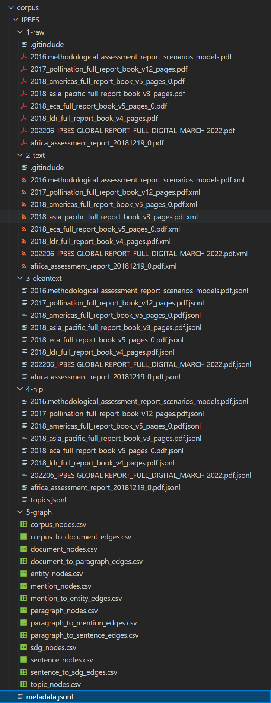

# Deployment Instructions

## A. Clone the Github Repo

```
~/projects> git clone git@github.com:mikewillekes/unsdgftw.git
```

## B. Install Python prerequisites via `pipenv`

Pipenv is a packaging tool that consolidates `pip`, `virtualenv` and `requirements.txt`. For more details on this tool see [Pipenv: A Guide to the New Python Packaging Tool](https://realpython.com/pipenv-guide/)

```
~/projects> cd unsdgftw

~/projects/unsdgftw> pipenv shell

~/projects/unsdgftw> pipenv install
```

Note: the NLP preprocessing steps were run using Spacy, Hugging Face - Transformers, Tensorflow and PyTorch. These dependencies were gathered into the Pipenv `dev` dependencies.

**These dev libraries are not necessary if you only want load and run the TigerGraph solution**. If you have an NVidia GPU with the Cuda 11.3 libraries installed and you do want to rerun the NLP steps use:

```
~/projects/unsdgftw> pipenv install --dev
```

## C. Create a TigerGraph Cloud Solution

Log in to [tgcloud.io](tgcloud.io) and create a new free-tier solution; Make note of the custom domain (i.e.: `unsdgftw.i.tgcloud.io`)

## D. Create a Local `.env` File for Secrets

Create the file `.env` in the project root (i.e. `unsdgftw/.env`) supplying the `tg_host` value from the previous step.

```
tg_host="https://unsdgftw.i.tgcloud.io"
tg_username="tigergraph"
tg_password="YOUR_TIGERGRAPH_SOLUTION_ADMIN_PASSWORD"
tg_token=""
```

The API token `tg_token` will be echoed to the console after the next step. 

## E. Create the TigerGraph Schema

All of the development of this Hackathon solution was done in Visual Studio Code with Python 3.8 - but for simplicity the following installation steps are all executed directly on the command line.

```
~/projects/unsdgftw> export PYTHONPATH=./src

~/projects/unsdgftw> python src/graph/tg_create_schema.py
```

Copy the `token` from the last line of the console output into the `.env` file. _Note: this token is scrubbed and recreated when the new schema is created, so don't copy the one in the attached screenshot._

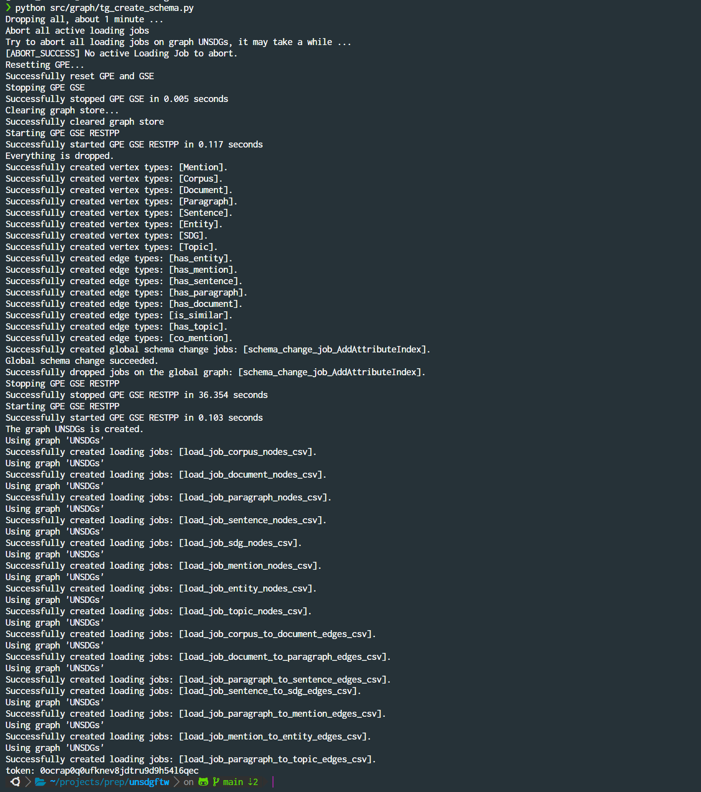

## F. Install the Queries

```
~/projects/unsdgftw> export PYTHONPATH=./src

~/projects/unsdgftw> python src/graph/tg_install_queries.py
```

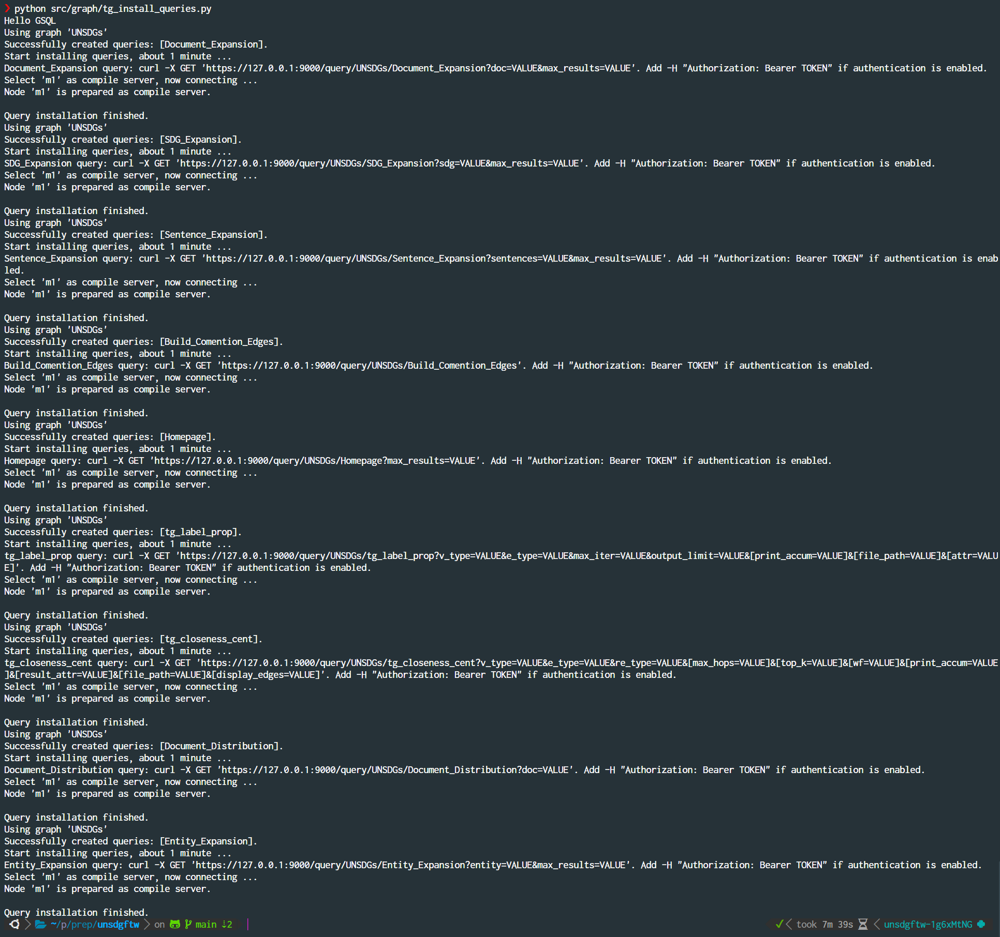

## G. Build and Load the Graph Data

```
~/projects/unsdgftw> export PYTHONPATH=./src

~/projects/unsdgftw> python src/run_pipeline_step_3_graph.py
```

Once loaded (and `build_comention_edges()` is complete) you should end up with approximately **600,000 Vertices** and **1,100,000 Edges**

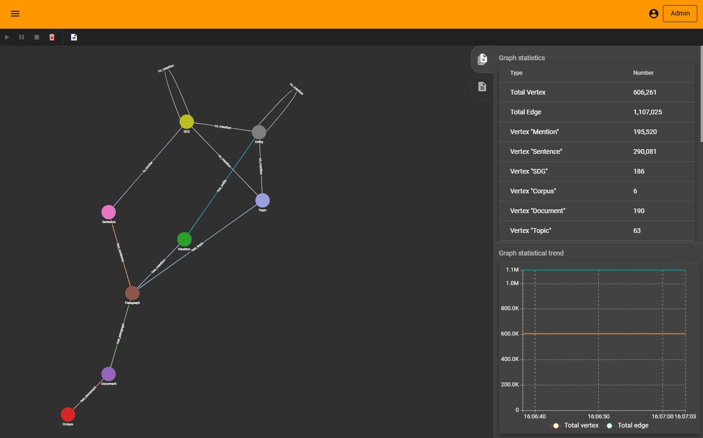

## F. Launch Streamlit Web Application

```
~/projects/unsdgftw> export PYTHONPATH=./src

~/projects/unsdgftw> streamlit run src/streamlit_app.py
 
 You can not view your Streamlit app in your browser.

 Network URL: http://X.X.X.X:8501
 External URL: http://Y.Y.Y.Y:8501
```

Click (or copy-and-paste) the Network URL to open in your browser.

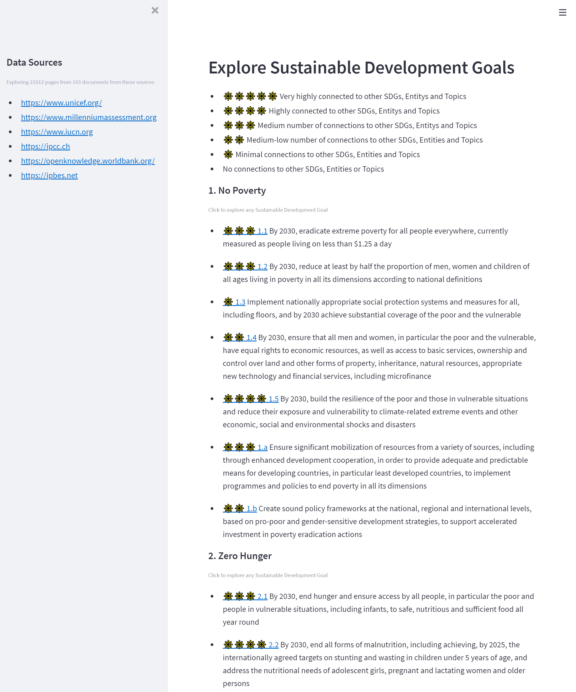

# Reflections

## What Went Well

- From early-on, a priority was placed on scripts to automate the end-to-end flow: regenerating datasets from raw PDFs, to dropping-and-recreating the TigerGraph schema and installing queries, loading data and enriching the graphs with augmented edges, centrality and community detection; This enabled fast, frequent iteration as all of the moving parts started coming together
- The graph schema worked very well from inception to delivery
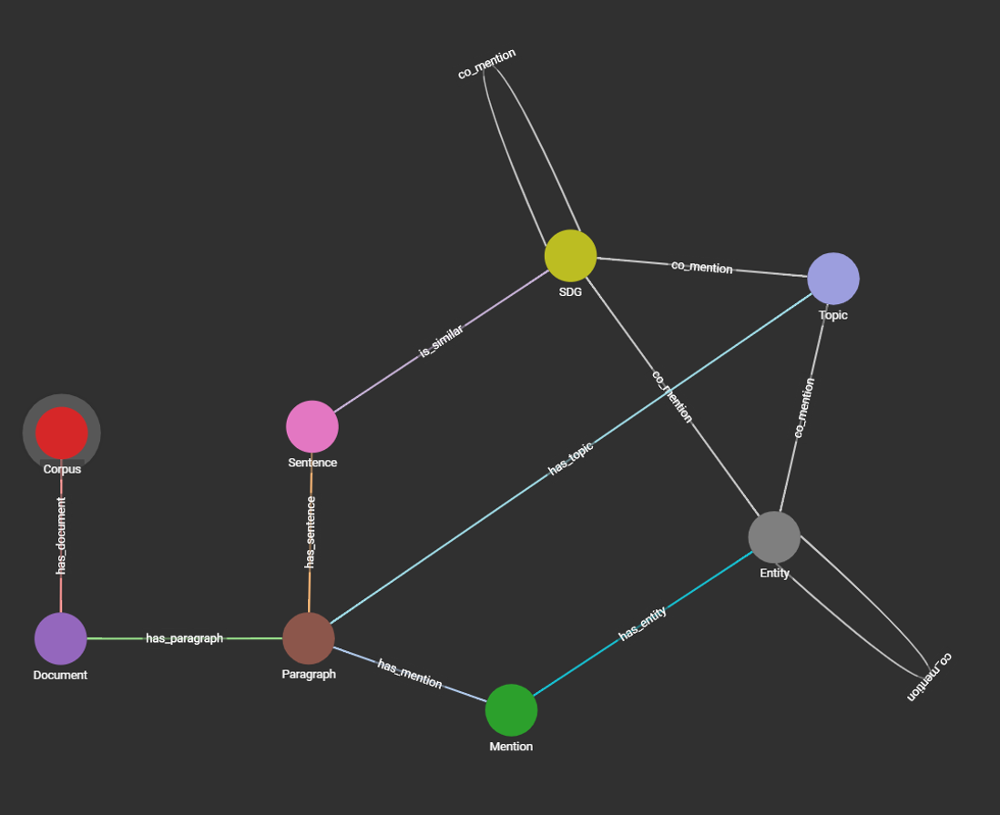
- The TigerGraph and GSQL tools were easy get started, well documented and performed extremely well; however it did take a while to adjust to thinking in terms of GSQL and Accumulators vs. relational SQL

## Known Issues and Future Improvements

- It was out of scope to build a semantic _search_ interface, only exploration; a future improvement would be to include a semantic search solution via vector similarity.
- Semantic similarity (cosine distance) was calculated between each sentence and each SDG sub-goal using a pre-trained transformer model. This simple unsupervised ML approach often had difficulties distinguishing between multiple but similar SGS. Likely a supervised multi-class classifier approach could achieve better results.
- Research documents themselves contains numerous references to other publications. These were *not* taken into account when building the Knowledge Graph. 
- Topics, extracted as a collection of words, are _weird_ for displaying to non-NLP enthusiasts. We understand what _"fgm|girls|practice|women|undergone|aged|who|prevalence|years|15"_ is about, but it's not a user-friendly way to display data.
- SDGs, Entities and Topics were considered 'related' if they co-occurred in the same Paragraph. This is a naive rule that doesn't always hold true (i.e. for very long paragraphs).
- More Data! About 200 PDFs (~21K Paragraphs of text) were crawled across 5 organizations. The focus of this project was on the NLP, graph algorithms and UI development instead. However with a bit more work, this approach could easily scale to 1000s of documents. 
- The TigerGraph CSV API is clunky to use as schema changes. Late in the project, a few new fields were added to nodes and edges to explore capabilities of the TigerGraph data science library; but this broke all the existing loading scripts as positional CSV column designations match anymore.
- It could be compelling to explore a proof-of-concept using this Knowledge Graph to generate graph embedding that could be shared to enrich other downstream machine learning tasks. 

## Open Source Tools
- [Hugging Face: Transformers](https://huggingface.co/docs/transformers/index)
- [spaCy](https://spacy.io/)
- [BERTopic: Topic modelling with Transformers](https://maartengr.github.io/BERTopic/index.html)
- [Apache Tika: PDF Text Extraction](https://tika.apache.org/)
- [Beautiful Soup: HTML processing](https://beautiful-soup-4.readthedocs.io/en/latest/)

## Blog Posts and Videos
- [Use PyTorch and TensorFlow with an NVIDIA GPU in the Windows Linux Subsystem (WSL)
](https://youtu.be/mWd9Ww9gpEM)
- [Organizing your scholarly PDFs to easily find keywords using pdfminer.six](https://medium.com/@boilertoad_30976/organizing-your-scholarly-pdfs-to-easily-find-keywords-using-pdfminer-six-b50409b5015f)
- [Semantic Search with Sentence Transformers](https://github.com/UKPLab/sentence-transformers/tree/master/examples/applications/semantic-search)
- [Fast Clustering with Sentence Transformers](https://github.com/UKPLab/sentence-transformers/blob/master/examples/applications/clustering/fast_clustering.py)
